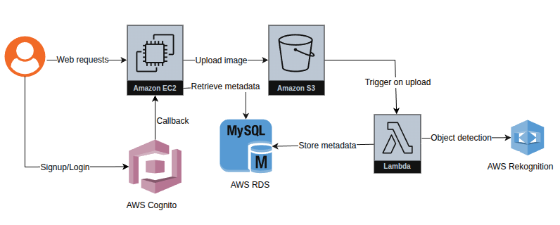

# Object Recognition Application

This is a web application where users can upload images and get to know about the detected objects 
in the image.

---
## Key Features

-  **User authentication with Amazon Cognito**  
  Users can sign up and log in through AWS Cognito’s hosted UI. Flask handles the OAuth2 callback.

- **Image Storage with Amazon S3**  
  Users can upload images which is stored in AWS S3 bucket.

-  **Object recognition using Amazon Rekognition**  
  Objects in the image is detected using Amazon Rekognition.

- **Access previously uploaded photos**  
  Logged-in users can browse previously uploaded images along with the detected object labels.
---

## 🛠️ Technologies Used
- **Flask** — Python web framework to build the backend
- **HTML5**, **CSS3** — For frontend development
- **Amazon Cognito** — For user authentication and authorization
- **Amazon S3** — Image storage
- **Amazon Lambda** — Invoke object recognition service on image upload
- **Amazon Rekognition** — To detect object in image
- **Amazon RDS** — Storage for detected object labels and object metadata
- **AWS EC2** — To host the web application

